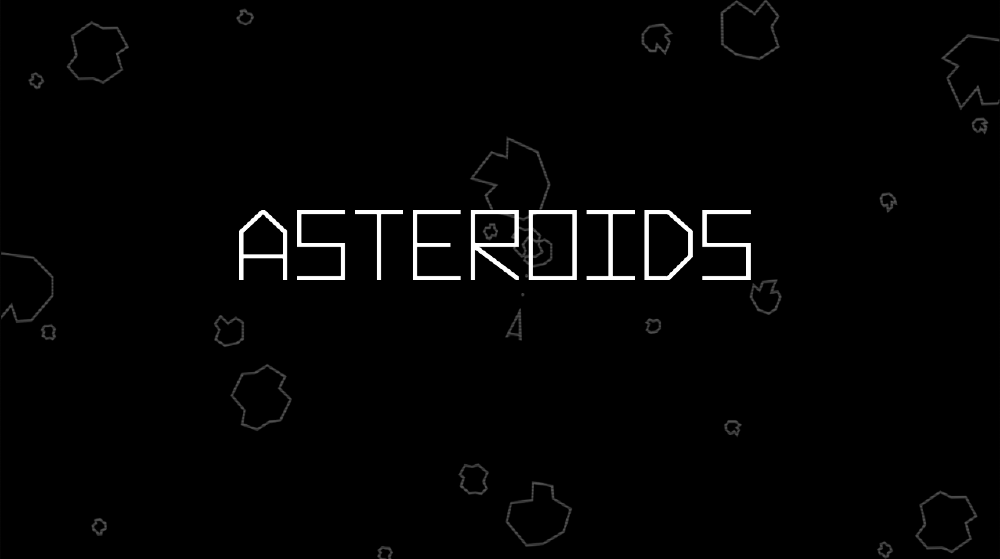
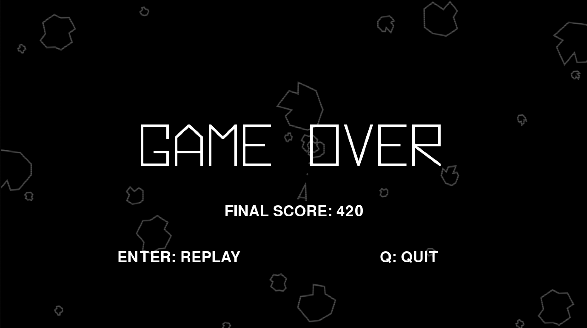

### Asteroids inspired pygame
I made this little game by following the course on boot.dev called: **Build Asteroids**


## Splash screen



## Game over screen



## Get started:

### Requirements:
- Python 3.13
- Pygame 2.6.1
- uv 

1. clone the repository
```bash
git clone https://github.com/ahmed-bahlaoui/asteroids-game
cd asteroids-game/
```
2. install all dependencies
```bash
uv sync
```

3. Run the game!
```bash
uv run main.py
```


TODO:
- Add a sqlite database to keep track of the best score
- Add a time duration to have game stats
